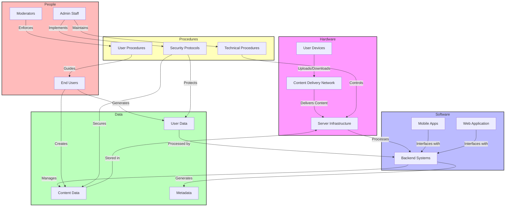

```mermaid
graph TD
    subgraph Hardware
        UD[User Devices]
        SI[Server Infrastructure]
        CDN[Content Delivery Network]
    end

    subgraph Software
        MA[Mobile Apps]
        WA[Web Application]
        BE[Backend Systems]
    end

    subgraph Data
        UD1[User Data]
        CD[Content Data]
        MD[Metadata]
    end

    subgraph People
        EU[End Users]
        AS[Admin Staff]
        MOD[Moderators]
    end

    subgraph Procedures
        UP[User Procedures]
        TP[Technical Procedures]
        SP[Security Protocols]
    end

    %% Hardware Connections
    UD -->|Uploads/Downloads| CDN
    CDN -->|Delivers Content| SI
    SI -->|Processes| BE

    %% Software Connections
    MA -->|Interfaces with| BE
    WA -->|Interfaces with| BE
    BE -->|Manages| CD

    %% Data Flow
    EU -->|Creates| CD
    EU -->|Generates| UD1
    CD -->|Stored in| SI
    UD1 -->|Processed by| BE
    BE -->|Generates| MD

    %% People Interactions
    MOD -->|Enforces| UP
    AS -->|Maintains| TP
    AS -->|Implements| SP

    %% Procedure Implementation
    SP -->|Protects| UD1
    SP -->|Secures| CD
    UP -->|Guides| EU
    TP -->|Controls| SI

    style Hardware fill:#f9f,stroke:#333,stroke-width:2px
    style Software fill:#bbf,stroke:#333,stroke-width:2px
    style Data fill:#bfb,stroke:#333,stroke-width:2px
    style People fill:#fbb,stroke:#333,stroke-width:2px
    style Procedures fill:#ffb,stroke:#333,stroke-width:2px
```
